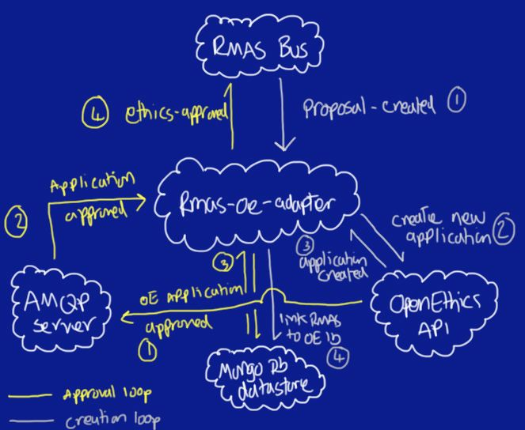

.. Rmas-to-openethics adapter documentation master file, created by
   sphinx-quickstart on Fri Dec 14 12:11:56 2012.
   You can adapt this file completely to your liking, but it should at least
   contain the root `toctree` directive.

Welcome to Rmas-to-openethics adapter's documentation!
======================================================
The rmas-oe-adapter is a key component in a proof of concept for integtrating `OpenEthics <https://github.com/UoK-Psychology/Openethics>`_
into the RMAS framework. The video below demonstrates this proof of concept, and explains how it works:

.. raw:: html

	<iframe src="http://player.vimeo.com/video/54785771?badge=0" width="500" height="281" frameborder="0" webkitAllowFullScreen mozallowfullscreen allowFullScreen></iframe> 
<a href="http://vimeo.com/54785771">RMAS-EE end to end demo</a> from <a href="http://vimeo.com/user14275825">Jason Marshall</a> on <a href="http://vimeo.com">Vimeo</a>.

The functions specific to the RMAS-OpenEthics-Adapter can be summarized by the diagram below:

   
This diagram represents the two functional loops that can occur within the adapter:

Creation loop
***************

This is the loop that is intitiated by a proposal-created message, and causes a new ethics application
to be created in OpenEthics, and is comprised of several steps:

1. The proposal-created message is received during a routine poll of the RMAS-Bus.
2. This causes the adapter to use the OpenEthics API to create a new Ethics Application, this uses the proposal title as the tile for the ethics application and, uses the principle investigator identified in the proposal as the pi for the ethics application. (There is a little more to it than that to read more go here)
3. OpenEthics Sends back the identifier for the new OpenEthics application.
4. The adapter persists a link between the RMAS identifier for the proposal and the OpenEthics ID  (this is for use in the approval loop).

Approval Loop
***************

1. OpenEthics sends an Application approved lifecycle message to the AMQP server
2. The adapter, which is registered as a listerner with the AMPQ server recieves the message
3. The adapter uses the OpenEthics Applcaition ID to look up the RMAS id of the proposal (see Creation Loop part 4)
4. The adapter builds and sends a ethics-approved message to the RMAS bus.

 

Additional Documentation
***************************

.. toctree::
	:maxdepth: 1
   
	pkgsetup
	codedocs

